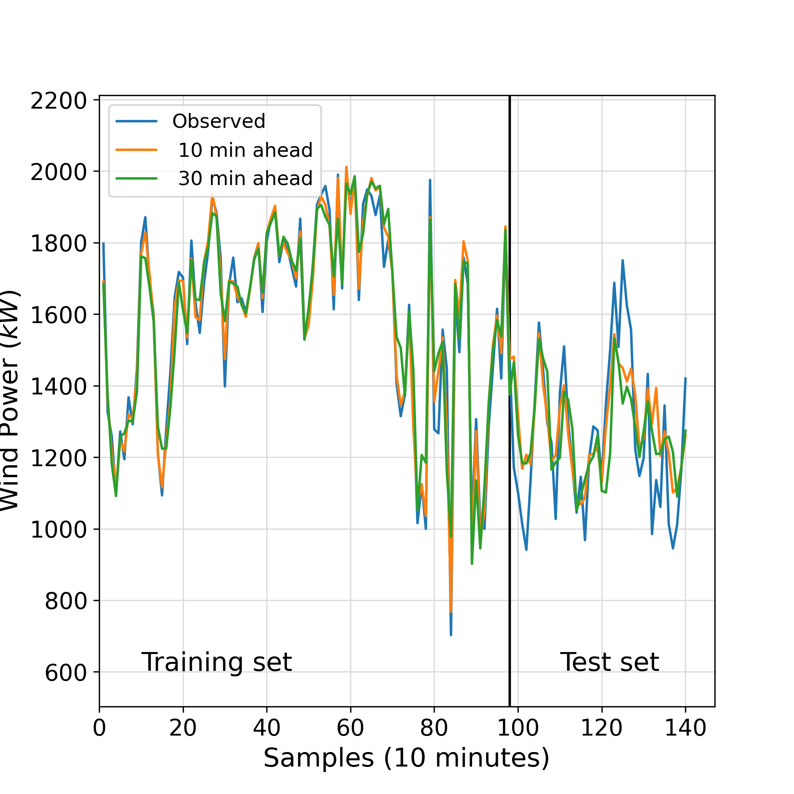
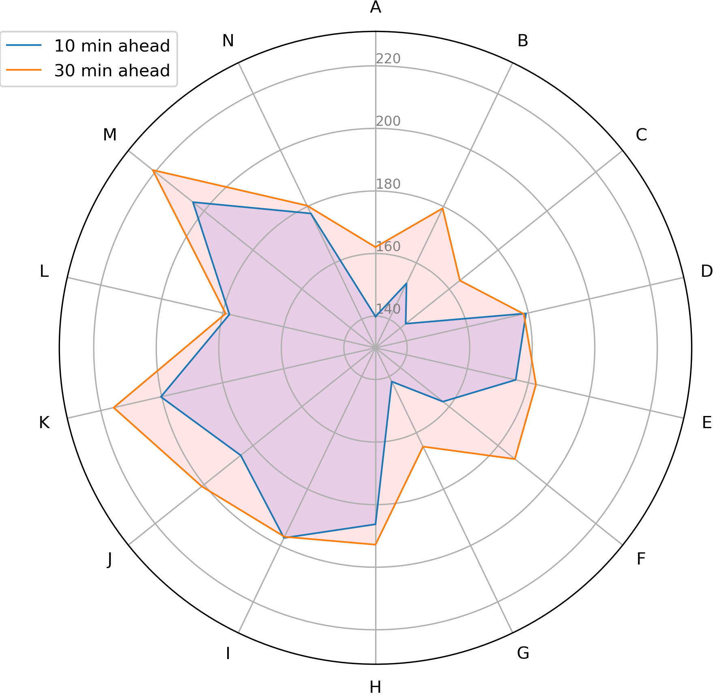

# Publication in Energy Elsevier Journal
## :dash::zap: A novel hybrid decomposition-ensemble learning method for very short-term wind energy multi-step ahead forecasting
 | 
:------------------------------------:|:-------------------------:
Predictions versus observed values    | Errors’ standard deviation for each model

### Publication
- [Preprint (ResearchGate)]()
- [Conference paper (ScienceDirect)]()
