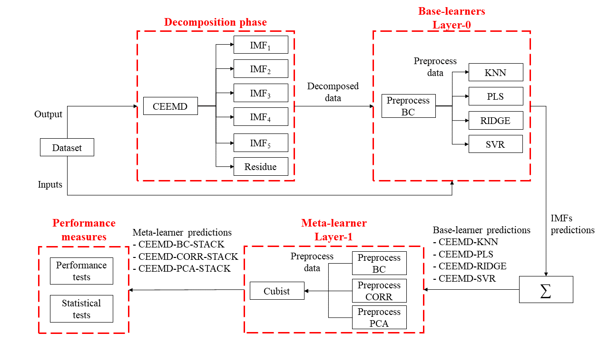

# Publication in [Energy Elsevier Journal](https://www.journals.elsevier.com/energy)
## :zap: A novel decomposition-ensemble learning framework for multi-step ahead wind energy forecasting
[</img> Ramon Gomes da Silva][RamonID], [</img> Matheus H. D. M. Ribeiro][MatheusID], [</img> Sinvaldo Rodrigues Moreno][SinvaldoID], [</img> Viviana Cocco Mariani][VivianaID], [</img> Leandro dos Santos Coelho][LeandroID]

|
:---|
**_Proposed forecasting framework_**|

### Publication
- [Preprint (ResearchGate)][RG]
- [Journal paper (ScienceDirect)][SD]

### How to cite this paper
```bibtex
@article{dasilva2020novel,
  title={A novel decomposition-ensemble learning framework for multi-step ahead wind energy forecasting},
  author={da Silva, Ramon Gomes and Ribeiro, Matheus Henrique Dal Molin and Moreno, Sinvaldo Rodrigues and Mariani, Viviana Cocco and Coelho, Leandro Santos},
  journal={Energy},
  volume={},
  pages={119174},
  year={2020},
  publisher={Elsevier},
  doi={10.1016/j.energy.2020.119174}
}
```

[RamonID]: https://orcid.org/0000-0001-8580-7695
[MatheusID]: https://orcid.org/0000-0001-7387-9077
[SinvaldoID]: https://orcid.org/0000-0001-6565-9605
[VivianaID]: https://orcid.org/0000-0003-2490-4568
[LeandroID]: https://orcid.org/0000-0001-5728-943X
[RG]: https://www.researchgate.net/publication/345178942_A_novel_decomposition-ensemble_learning_framework_for_multi-step_ahead_wind_energy_forecasting
[SD]: https://www.sciencedirect.com/science/article/abs/pii/S0360544220322817