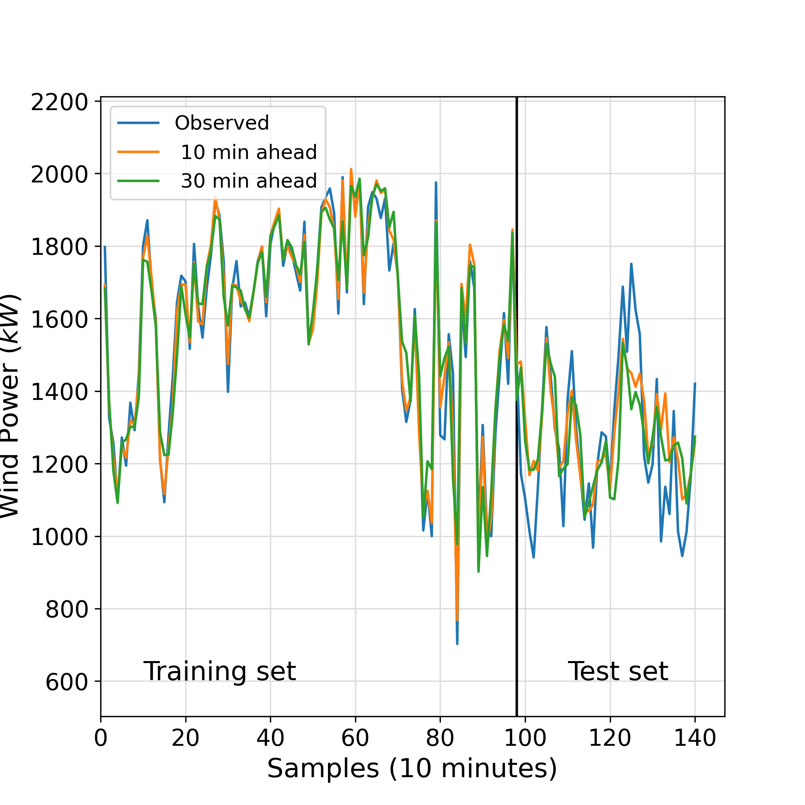
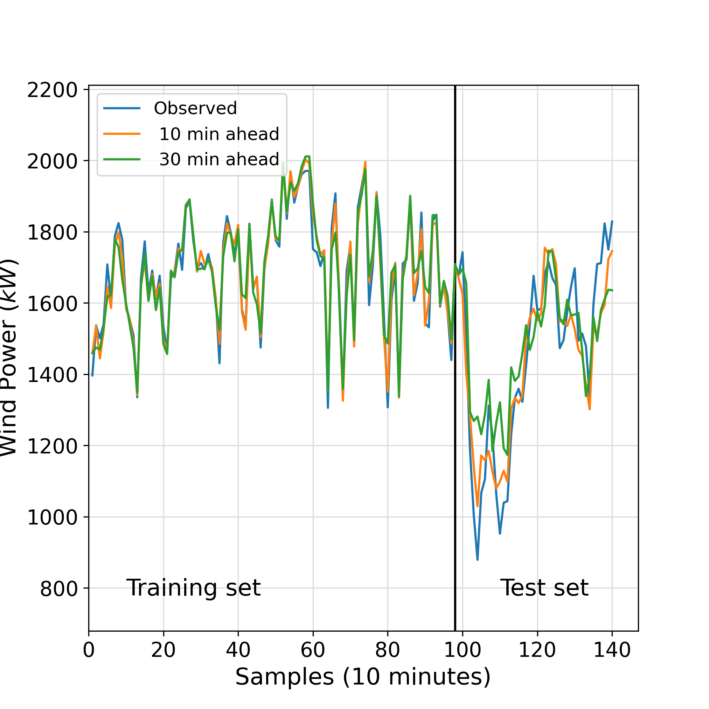
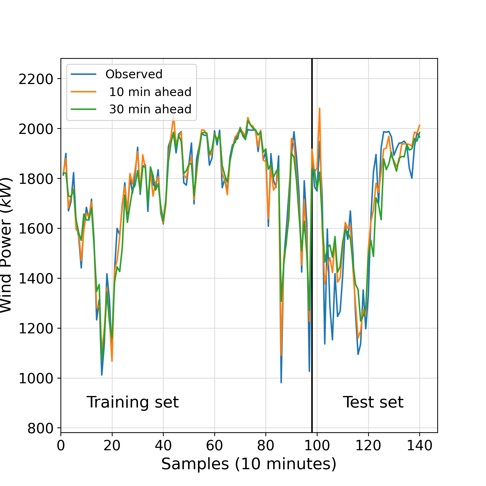
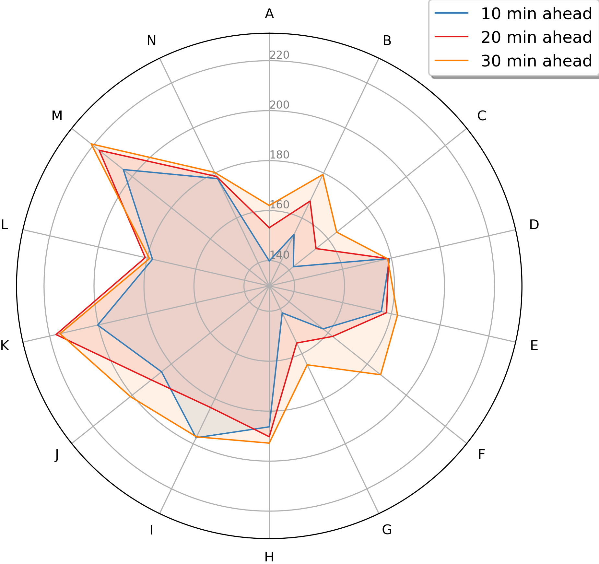
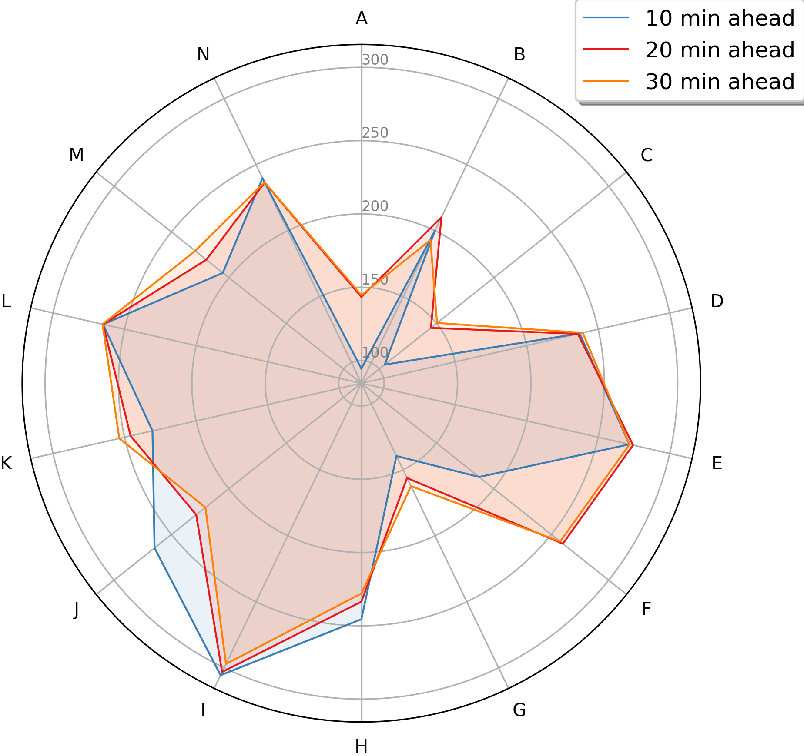
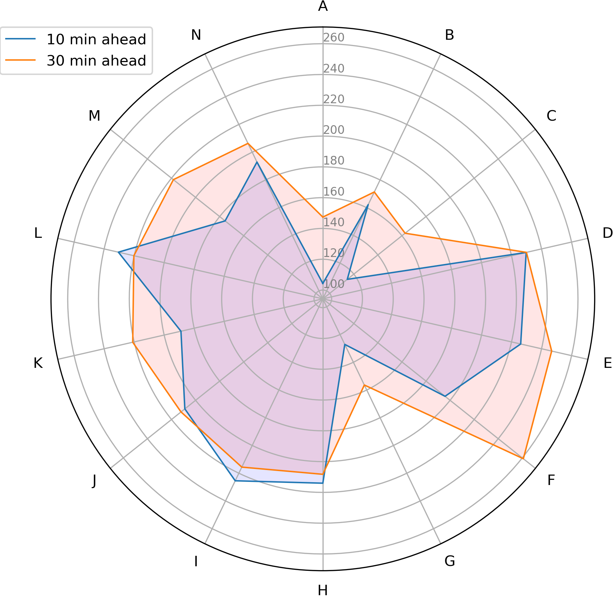

# Publication in Energy Elsevier Journal
## :zap: A novel hybrid decomposition-ensemble learning method for very short-term wind energy multi-step ahead forecasting
Dataset 1 | Dataset 2 | Dataset 3
:---:|:---:|:---:
 |      |  |
  |       |   |

### Publication
- [Preprint (ResearchGate)]()
- [Journal paper (ScienceDirect)]()

### How to cite this paper
```bibtex

```
